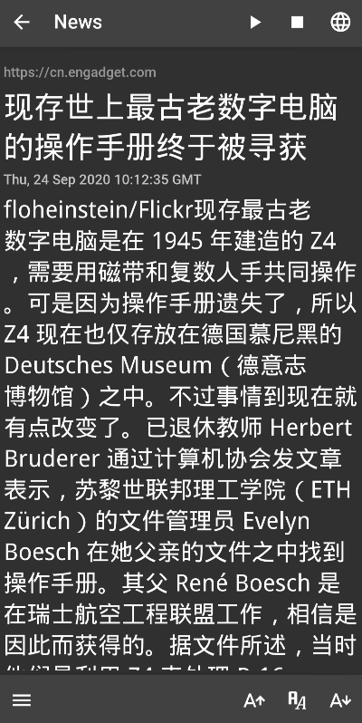

# Mandarin-News-Feed
daily read news &amp; learn words daily 

Learn Mandarin language by reading news daily. Also save new words and export to Anki decks.

The app created using kivy, kivymd and many other open source projects entirely in python. View [app_license.json](https://github.com/infinyte7/Mandarin-News-Feed/blob/master/Mandarin%20News%20Feed/app_license.json).

**Note: I have just created this app to learn kivy and kivymd.**

# Demo

</img>

# Features
- Night mode
- Text to speech offline and online
- View news by topic or search query
- New words at main screen (HSK level)
- Change font size of news article text
- Export words as [Anki](https://apps.ankiweb.net/) deck
- Click on words to view their meaning while reading news
- Daily news using Google RSS feed (Chinese language only)
- Save new words to text files separated by news and daily words
- Change font (put new fonts to ```Mandarin News Feed/fonts``` folder)
- When new words saved then words data in form of ```.json``` file saved in ```Mandarin News Feed/saved_words_json``` folder for offline viewing
- When online text to speech feature used, then audio for that words saved to ```Mandarin News Feed/saved_audio``` for offline usage. 


# Download
Download the app from the GitHub release page.

https://github.com/infinyte7/Mandarin-News-Feed/releases

# After install
### Change default fonts
Download new chinese font and paste it inside ```Mandarin News Feed/fonts```, if folder not present then create the folder.

### Load words data from local folder
Download cedict-json data from [github.com/infinyte7/cedict-json](https://github.com/infinyte7/cedict-json) and paste it in ```Mandarin News Feed/words_json_data```, if folder not present then create the folder. Note: In ```words_json_data``` only put ```.json``` files only.


### Faq?

#### Why is it always crashing?
The app still in alpha version. Every new updates will try to reduce the crash.
Also, trying to remove this error.
```
ReferenceError: weakly-referenced object no longer exists
```

#### Where is all the files stored?
The files stores in ```storage/emulated/0/Mandarin News Feed/``` folder.

#### How can I delete the saved words from daily words and news words?
Remove ```daily_words_data.txt``` and ```news_words_data.txt```, from ```Mandarin News Feed/wordslist``` folder.

#### Why app size so big?
All python modules required by the app is packed inside the app. So that app size is big.

List of python modules

```
requirements = python3,kivy,kivymd,genanki,cached_property,frozendict,pystache,pyyaml,pillow,pyjnius,
newspaper3k,requests,nltk,sgmllib3k,jieba3k,feedfinder2,tinysegmenter,tldextract,python-dateutil,lxml,cssselect,
feedparser,beautifulsoup4,idna,click,joblib,regex,tqdm,chardet,certifi,urllib3,soupsieve,requests-file,xmltodict,
pycedict,pinyin,HanziConv,googletrans,httpcore,sniffio,httpx,h11,hstspreload,rfc3986,hstspreload,h2,contextvars,
hyperframe,hpack,immutables,asyncio,aiohttp,multidict,yarl,async-timeout,attrs,aiogtts
```

## Build the project
All the code and required files are in ```Mandarin News Feed``` folder of this GitHub repository. 
1. Fork this repository
2. Install python, kivy and kivymd
3. The project used following python modules. Note: When creating app using buildozer then put all the dependencies required by the module in ```requirements = ```

```
kivy
kivymd
pillow
pyjnius
genanki
newspaper3k
jieba
beautifulsoup4
certifi
pycedict
pinyin
HanziConv
googletrans
aiohttp
aiogtts
```
4. Use ```buildozer.spec``` and create the app for target system.
View https://github.com/kivy/buildozer for more.

# Contribution
PR with features and bug fixes

# License
Mandarin News Feed
<br>Mani
<br>The MIT License

### Other third party licenses
View [app_license.json](https://github.com/infinyte7/Mandarin-News-Feed/blob/master/Mandarin%20News%20Feed/app_license.json)

## Image Gallery
|Normal Mode|Dark Mode|
|--|--|
|</img>|</img>|
|</img>|</img>|
|</img>|</img>|
|</img>|</img>|
|</img>|</img>|
|</img>|</img>|
|</img>|</img>|
|</img>|</img>|
|</img>|</img>|
|</img>|</img>|